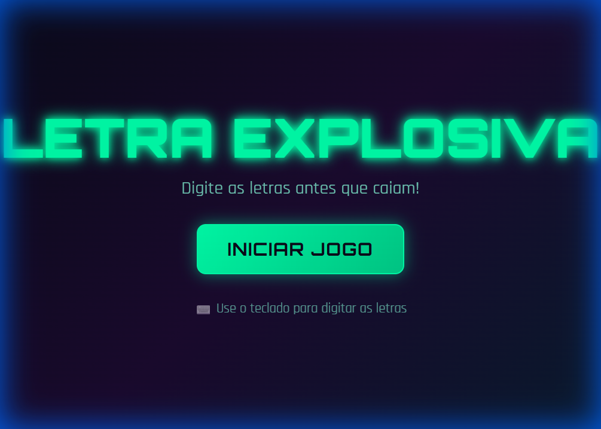
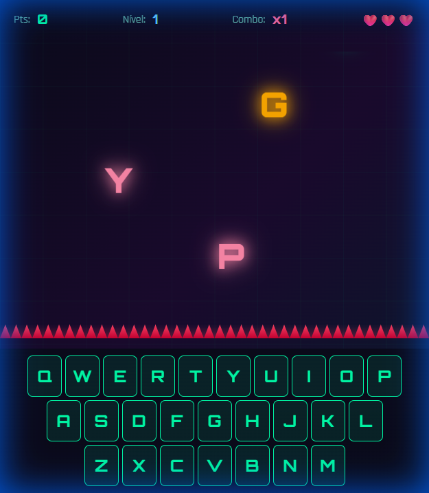

# 🎮 Letra Explosiva

Jogo de digitação rápida com design mobile-first, PWA e efeitos visuais neon!



## 📱 Mobile First

O jogo foi desenvolvido com foco em dispositivos móveis, incluindo teclado virtual QWERTY para jogar no celular!



## ✨ Funcionalidades

| Recurso | Descrição |
|---------|-----------|
| 🏆 **High Score** | Salvo no localStorage, persiste entre sessões |
| 📈 **Sistema de Níveis** | Dificuldade aumenta a cada 15 segundos |
| ⚡ **Power-ups** | ❤️ Vida Extra, ⏱️ Slow Motion, 💣 Bomba |
| ⏸️ **Modo Pausa** | Tecla ESC ou P para pausar |
| 🔊 **Efeitos Sonoros** | Web Audio API (sem arquivos externos) |
| 📲 **PWA** | Instale como app no celular |

## 🎯 Como Jogar

1. **Desktop**: Use o teclado para digitar as letras que caem
2. **Mobile**: Toque nas letras do teclado virtual
3. Acerte as letras antes que atinjam os espinhos!
4. Acumule combos para multiplicar sua pontuação
5. Colete power-ups para ajudar na jornada

## 🛠️ Tecnologias

- HTML5 / CSS3 / JavaScript ES6
- Web Audio API (efeitos sonoros)
- Service Worker (funciona offline)
- PWA (Progressive Web App)

## 📁 Estrutura

```
letra_explosiva/
├── index.html      # Estrutura HTML com SEO
├── styles.css      # Design mobile-first
├── game.js         # Engine do jogo (ES6 Class)
├── manifest.json   # Configuração PWA
├── sw.js           # Service Worker
├── icons/          # Ícones do app
└── screenshots/    # Capturas de tela
```

## 🚀 Deploy

O jogo pode ser hospedado em qualquer servidor estático:

- **GitHub Pages**: Ative nas configurações do repositório
- **Netlify**: Arraste a pasta para o dashboard
- **Vercel**: Conecte o repositório

## 📜 Licença

MIT License - Sinta-se livre para usar e modificar!

---

**Desenvolvido com 💚 e muitas explosões de letras!**
